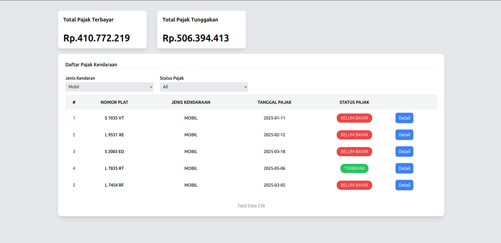
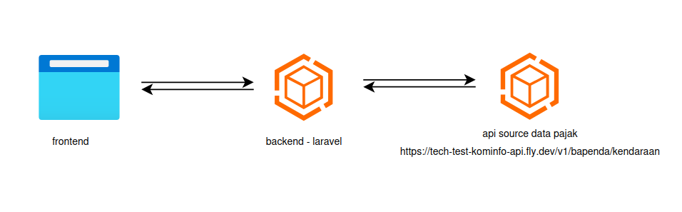
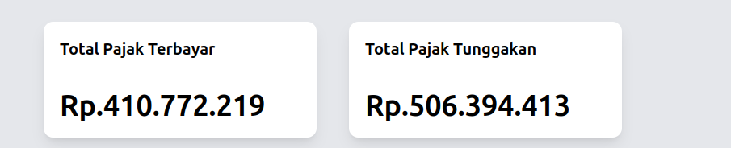
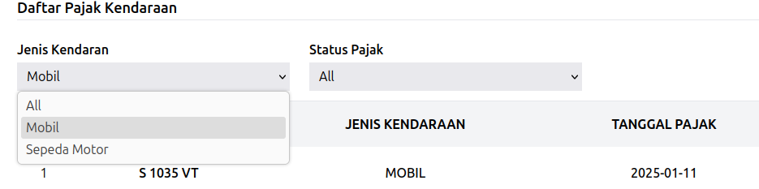
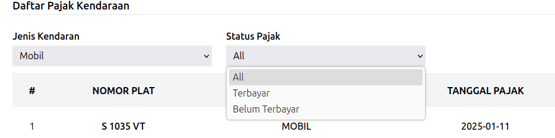
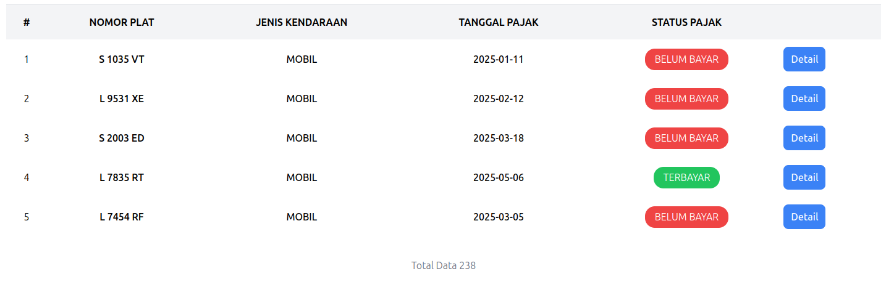
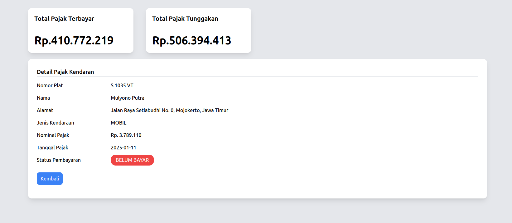
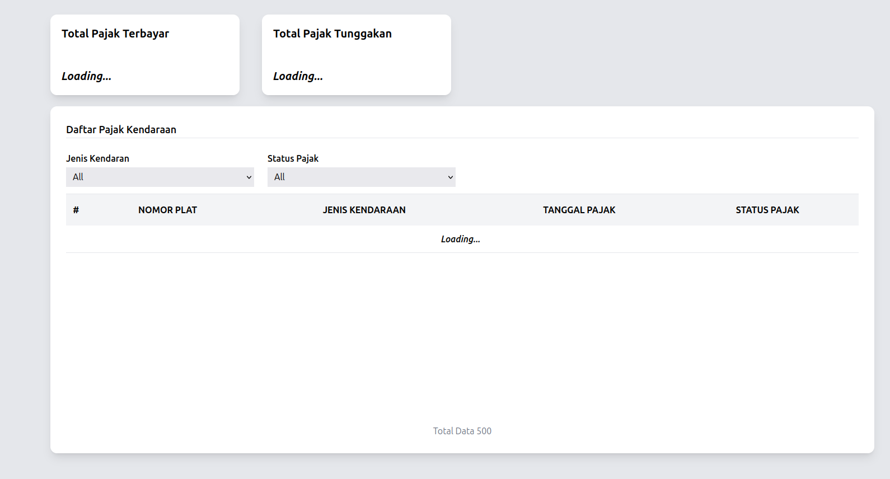

# Technical Test

## Deskripsi Umum:
Buatlah sebuah aplikasi fullstack yang terdiri dari:

  - Backend menggunakan **Laravel**
  - Frontend menggunakan **Vue.js** atau **React** dengan **Tailwind CSS** 
  - Tidak menggunakan **UI component library** ⚠️ 

Aplikasi ini digunakan untuk menampilkan daftar dan rekap pajak kendaraan, termasuk melakukan filter serta menampilkan detail data pajak kendaraan.



### Sumber Data

Dalam project ini anda akan menggunakan sumber data kendaraan yang dapat diperoleh dari file json berikut [Download Disini](https://drive.google.com/file/d/1ypYy-MYoGH_BIzdcARvg8vssgczNu3xh/view?usp=drive_link)  atau menggunakan API Eksternal berikut ini
 

```bash
  GET https://tech-test-kominfo-api.fly.dev/v1/bapenda/kendaraan
```

### ⚠️ Perhatian: 

Anda akan mendapatkan point **lebih** apabila memperoleh data dari API Eksternal berikut secara server to server. Data dari API Eksternal tersebut masih belum diolah dan tidak mendukung fitur filter

berikut bentuk arsitektur aplikasi apabila memperoleh data dari API Eksternal 




### Detail Spesifikasi Aplikasi
### A. Backend - Laravel


#### Spesifikasi Route
1.Buatlah Endpoint: GET `/api/pajak/kendaraan`

Mengembalikan daftar data pajak kendaraan. Pastika endpoint yang dibuat memiliki filter sebagai berikut:

- jenis_kendaraan : mobil atau sepeda motor
  
  Memperoleh data pajak kendaraan berdasarkan jenis kendaraan 

  contoh: 
  
  GET `/api/pajak/kendaraan?jenis_kendaraan=mobil`
  
  GET `/api/pajak/kendaraan?jenis_kendaraan=sepeda_motor`


- status_pembayaran : terbayar atau belum_bayar

  Memperoleh data pajak kendaraan berdasarkan status pembayaran

  contoh: 
  
  GET `/api/pajak/kendaraan?status_pembayaran=terbayar`
  
  GET `/api/pajak/kendaraan?status_pembayaran=belum_bayar`


Bentuk response GET `/api/pajak/kendaraan` :

```json
{
  "data": [
    {
      "nama": "Bakiman Dabukke",
      "plat_nomor": "AG 8768 MN",
      "jenis_kendaraan": "sepeda motor",
      "nominal_pajak": 302141,
      "tgl_pajak": "2025-03-26",
      "tgl_pembayaran": null,
      "alamat": "Jl. BKR No. 9, Blitar, Jawa Timur"
    },
    ...
  ],
  "totalData": 12,
  "message": "Success Get List Pajak Kendaraan"
}

```

2.Buatlah Endpoint: GET `/api/pajak/kendaraan/rekap`

Pada endpoint ini mengembalikan rekap total pajak dengan ketentuan sebagai berikut:

- Terdapat property terbayar

  Property ini adalah total keseluruhan  nominal pajak dari data yang memiliki `tgl_pembayaran` bernilai tidak null

- Terdapat property tunggakan
  
  Property ini adalah total keseluruhan nominal pajak dari data yang memiliki `tgl_pembayaran` bernilai **null**

Dibawah ini adalah contoh data pajak yang terbayar dan tunggakan

```json
{
  "data": [
    {
      "nama": "Bakiman Dabukke",
      "plat_nomor": "AG 8768 MN",
      "jenis_kendaraan": "sepeda motor",
      "nominal_pajak": 302141,
      "tgl_pajak": "2025-03-26",
      "tgl_pembayaran": null, // ⬅️ BELUM TERBAYAR
      "alamat": "Jl. BKR No. 9, Blitar, Jawa Timur"
    },
    {
      "nama": "Drs. Salwa Wibowo, S.Psi",
      "plat_nomor": "P 2404 XW",
      "jenis_kendaraan": "sepeda motor",
      "nominal_pajak": 360867,
      "tgl_pajak": "2025-04-08",
      "tgl_pembayaran": "2025-03-09", // ⬅️ SUDAH TERBAYAR
      "alamat": "Gg. Yos Sudarso No. 70, Banyuwangi, Jawa Timu"
    },
    ...
  ],
  "totalData": 12,
  "message": "Success Get List Pajak Kendaraan"
}
```


Dibawah ini adalah bentuk response dari endpoint  GET `/api/pajak/kendaraan/rekap` 

```json
{
  "data": {
    "terbayar": 9000000,
    "tunggakan": 4000000
  },
  "message": "Success Get Rekap Pajak Kendaraan"
}

```


### B. Frontend - Vue.js atau React
1.Tampilan Rekap



Di bagian atas halaman, tampilkan 2 Card rekap:

  - Total Pajak Terbayar

  - Total Pajak Tunggakan

Ambil data dari endpoint GET `/api/pajak/kendaraan/rekap`

2.Filter Daftar Pajak

Sediakan 2 dropdown filter:

- Jenis Kendaraan: Semua, Mobil, Sepeda Motor


- Status Pembayaran: Semua, Terbayar, Belum Bayar


Gunakan filter ini untuk mengambil data dari endpoint GET `/api/pajak/kendaraan`

3.Tabel Pajak Kendaraan

Terdapat Kolom:
  - NO
  - NOMOR PLAT
  - JENIS KENDARAAN
  - TANGGAL PAJAK
  - STATUS PAJAK
  - AKSI (tombol Lihat Detail)

Status pajak ditampilkan sebagai:
- Terbayar (jika `tgl_pembayaran` tidak null)
- Belum Bayar (jika `tgl_pembayaran` null)

Dibawah tabel terdapat informasi total data



data diperoleh dari endpoint endpoint GET `/api/pajak/kendaraan`

4.Detail Data Pajak



Ketika klik tombol "Lihat Detail", tampilkan modal atau halaman detail dengan informasi:
- Nomor Plat
- Nama
- Alamat
- Jenis Kendaraan
- Nominal Pajak
- Tanggal Pajak
- Status Pembayaran

⚠️ Tidak ada endpoint untuk GET detail, anda dapat mengolah data melalui daftar pajak kendaraan untuk mendapatkan detail data

5.Loading state (poin tambahan)

Ketika proses fetching data ke backend, buatlah loading state



### Informasi Pengumpulan
1.Waktu Pengerjaan: Hari Sabtu, 10 Mei 2025 Pukul 08.00 s/d 15.00

2.Format pengumpulan
- Sertakan link repository (GitHub/GitLab) yang berisi folder `backend/` dan `frontend/`
- Sertakan file `README.md` di root repo berisi:
  - Teknologi yang digunakan dan versi yang digunakan
  - Langkah instalasi dan menjalankan project backend dan frontend


3.Isi form pengumpulan pada [form berikut](https://s.id/SubmitTest)
